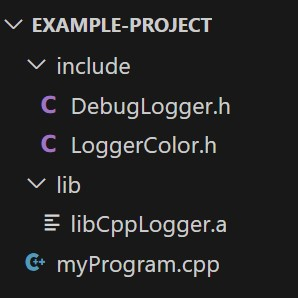

# CppLogger Version 1.0
CppLogger is cross-platform develoment light library to display beautiful message of logging in your console or in an output file.
More documentation is available in the README.md of the [main branch](https://github.com/florianLopitaux/CppLogger/tree/main) of this repository.

The library can be used simply by doing a basic link edit with the static library at compile time.
If you don't know how to do this, you can follow this short tutorial just below.

## How to use the CppLogger library in your project ? (using **gcc**)
1. Download the required files
> Download the header files (.h) in the **include** folder and the archive file (.a) in the **lib** folder and put them in your project.

*example of project architecture*



<br/>

2. Include and use them in your program
> Then import the headers files, according to what you want to use as functionalities, in your code and use the library as you wish. (see [library wiki](https://github.com/florianLopitaux/CppLogger/wiki))

```
#include "DebugColor.h"
#include ...
```

<br/>

3. Compile your code
> Finally, when your compile your code linked the static library using the options of compilation.
> <br/> *example using the previous architecture*
```
g++ myProgram.cpp -o myProgram.exe -I include/ -L lib/ -lCppLogger
```
> The **-L** option is used to specify the folder that contains the static libraries (.a).
> <br/> The **-l** option is used to link the static library file. We don't need to specify the *lib* of our file, that's a **gcc** standard.
> <br/> The **-I** option is used to specify an additional root repository to our header files. If we don't specify that, we should have marked in our code the relative path to our file when importing them.

<br/>

4. Enjoy
> And thath's it, your program should be worked !

Enjoy your use of **CppLogger** 🙂
